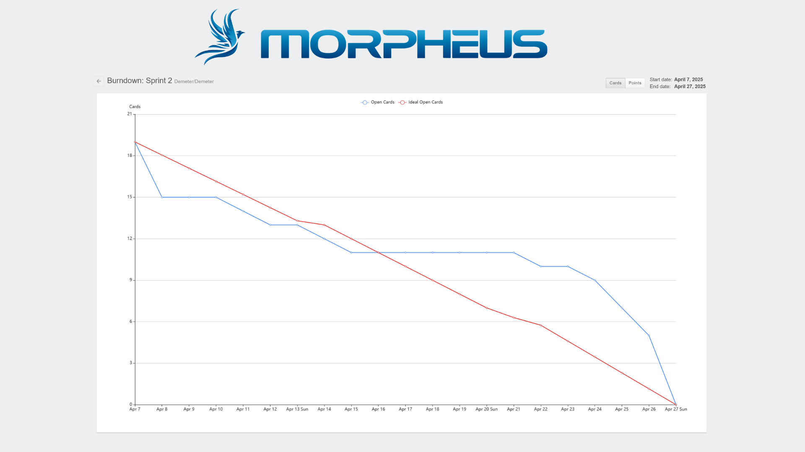

# 
 Morpheus x Visiona - API 4º Semestre - BD 2025
Editor de polígonos que oferece métricas qualitativas e quantitativas sobre as correções. Projeto desenvolvido para a disciplina de Tecnologia em Banco de Dados da Fatec São José dos Campos - Prof. Jessen Vidal.

 
 

    
    

 

  <a href="#integrantes-da-equipe">Integrantes da Equipe</a> •
  <a href="#descrição-do-desafio">Descrição do Desafio</a> •
  <a href="#objetivo">Objetivo do Projeto</a> •
  <a href="#requisitos">Requisitos Funcionais</a> •
  <a href="#cronograma">Cronograma</a> •
  <a href="#product-backlog">Product Backlog</a> •
  <a href="#grafico-burndown">Gráfico Burndown</a> •
  <a href="#documentação">Documentação</a> •
  <a href="#tecnologias-utilizadas">Tecnologias Utilizadas</a>

 

## :mortar_board: <a id="integrantes-da-equipe"> Integrantes da Equipe: </a>

| **Nome**                   | **Função**            | **LinkedIn**                                                  |
|:----------------------:|:-----------------:|:----------------------------------------------------------:|
| César Truyts           | Scrum Master      |  |
| Mateus Marques          | Product Owner    |  |
| Elbert Jean         | Desenvolvedor     |  |
| Gabriel Souza           | Desenvolvedor     |  |
| Isaque de Souza           | Desenvolvedor     |  |
| Ricardo Campos         | Desenvolvedor     |  |
| Paloma Soares  | Desenvolvedor     |  |
| Vinícius Monteiro  | Desenvolvedor     |  |

 

## :anger: <a id=descrição-do-desafio> Descrição do Desafio </a>

Editor de polígonos que oferece métricas qualitativas e quantitativas sobre as correções..

 

## :dart: <a id="objetivo"> Objetivo do Projeto

Este projeto tem como objetivo desenvolver um sistema Web para análise e edição geoespacial voltado para o setor agrícola, permitindo a interação entre administradores, analistas e consultores. A plataforma fornecerá ferramentas para visualização, edição e análise de dados geoespaciais em tempo real, contribuindo para a melhoria da performance de modelos de inteligência artificial utilizados no mapeamento agrícola. Além disso, o sistema oferecerá um dashboard para monitoramento e possibilitará a utilização de benchmarks da produtividade dos analistas.

 

## :page_facing_up: <a id="requisitos"> Requisitos Funcionais </a>

| Funcionalidade                          | Indicador |
|-----------------------------------------|-----------|
| Cadastro de talhões agrícolas (.geojson) | I      |
| Mapa Interativo para Visualização e Edição de GeoJSON   | II       |
| Histórico de Alterações nos Talhões     | III       |
| Download dos Talhões Revisados         | IV        |
| Dashboards com Métricas sobre os Consultores e a IA   | V   |
| Controle de Permissões e Usuários          | VI      |

 

## :calendar: <a id="cronograma"> Cronograma </a>

| Sprint  | Nome | Data inicio  | Data Fim | Status |
| ------------- | ------------- | ------------- | ------------- | ------------- |
| --  | KickOff   | 24/02   | 28/02 | Ok |
|  1  | Sprint 1   | 10/03   | 30/03 | Ok |
|  2  | Sprint review / Planning   | 31/03   | 04/04 | Ok |
|  3  | Sprint 2   | 07/04   | 27/04 |  |
|  4  | Sprint review / Planning  | 28/04   | 02/05 |  |
|  5  | Sprint 3   | 05/05   | 25/05 |  |
|  6  | Sprint review   | 26/05   | 28/05 |  |
|  7  | Feira de Soluções  | 29/12     |

 

## :date: <a id="product-backlog"> Product BackLog: </a>
| ID  | Como           | Desejo                                                                                     | Sprint | Prioridade | Dependência | Requisito |
|-----|----------------|--------------------------------------------------------------------------------------------|--------|------------|-------------|-----------|
| A   | Consultor      | Cadastrar talhões por meio do upload de arquivos no formato GeoJSON, para que seja possível visualizar e editar suas coordenadas e propriedades de forma eficiente. | 1      | Alta       | -           | I         |
| B   | Analista       | Visualizar os talhões agrícolas em um mapa interativo, para que eu possa realizar análise de suas coordenadas  e propriedades de forma eficiente. | 1      | Alta       | A           | II        |
| C   | Analista       | Filtrar e buscar talhões agrícolas com base em seus atributos, para que eu possa acessar rapidamente as áreas de interesse. | 1      | Média      | B           | II        |
| D   | Consultor      | Visualizar informações detalhadas dos talhões (nome da fazenda, cultura, área, etc.), para que eu possa planejar estratégias agrícolas e realizar análises mais precisas. | 1      | Baixa      | B           | II        |
| E   | Analista       | Editar os polígonos dos talhões no mapa, com foco na revisão e ajuste das classificações pré-realizadas, para garantir a precisão das informações e a adequação às necessidades agrícolas. | 2      | Alta       | B           | II        |
| F   | Analista       | Visualizar o histórico de alterações das classificações, para que eu possa auditar as mudanças realizadas e garantir a rastreabilidade das informações. | 2      | Alta       | E           | III       |
| G   | Consultor      | Exportar os talhões revisados em formato GeoJSON, para que eu possa reutilizá-los no refino da IA de classificação. | 2      | Alta       | E           | IV        |
| H   | Administrador  | Visualizar métricas de produtividade dos analistas, para que eu possa avaliar o desempenho da equipe de forma eficiente. | 2      | Alta       | E           | V         |
| I   | Analista       | Implementar o controle de tempo e edição dos talhões, para que eu possa metrificar as análises com maior eficácia. | 2      | Alta       | E           | V         |
| J   | Consultor      | Acessar mapa e dashboards com métricas, para que eu possa acompanhar o progresso do projeto de forma eficiente. | 2      | Média      | H. I   | V         |
| K   | Administrador  | Gerenciar usuários (cadastrar, editar, excluir), para que eu possa controlar o acesso ao sistema de maneira organizada e segura. | 3      | Média      | -           | VI        |
| L   | Administrador  | Atribuir permissões específicas para cada tipo de usuário, para que eu possa garantir a segurança e o controle de acesso às ferramentas do sistema. | 3      | Média      | K           | VI        |
| M   | Analista       | Receber notificações sobre talhões que precisam de revisão, para que eu possa priorizar meu trabalho de forma eficaz. | 3      | Baixa      | E           | III       |

<a href="/documentation/backlog.md" target="_blank">
    <button style="background-color:#4CAF50; color:white; padding:10px 20px; border:none; border-radius:5px; cursor:pointer;">
        Acessar critério de Aprovação
    </button>
</a>

 

## :chart_with_upwards_trend: <a id="grafico-burndown"> Gráfico Burndown </a>

    

 

## :clipboard: Board de Atividades

Acesse o Board de atividades do Time para visualizar as atividades planejadas, em desenvolvimento e prontas.

<a href="https://github.com/orgs/Morpheus-Fatec/projects/4" target="_blank">
    <button style="background-color:#4CAF50; color:white; padding:10px 20px; border:none; border-radius:5px; cursor:pointer;">
        Board de Atividades
    </button>
</a>

 

## :page_with_curl: <a id="documentação"> Documentação: </a>

### Sprint Backlog

Detalhamento do planejamento e objetivos de todas as sprints.
- **[Planejamento por Sprint](./documentation/sprints-planning.md)**

Estratégias e etapas definidas para o desenvolvimento da sprint em curso.
- **[Planejamento de Desenvolvimento](./documentation/Developing-planning.md)**

### Especificação do Sistema e Fluxos Operacionais

Controle de Acessos e Perfis de Usuários
- **[Descrição do Escopo de Usuários](./documentation/flows/user/user_flow.md)**
- **[Diagrama do Escopo de Usuários](./documentation/flows/user/user_flow.png)**

Ciclo Operacional de Análise

- **[Descrição do Fluxo de Análise e Avaliação](./documentation/flows/field/field_state_flow.md)**
- **[Diagrama do Fluxo de Análise e Avaliação](./documentation/flows/field/field_state_flow.png)**

### Banco de Dados

Organização das Entidades
- **[Descrição das Entidades](./documentation/database/entity_description.md)**

Script de criação do banco de dados.
- **[DDL do Banco de Dados:](./documentation/database/banco.sql)**

DER representando a estrutura do banco de dados do projeto, incluindo as relações entre as entidades.
- **[Diagrama Entidade-Relacionamento (DER) - Notação Chen](./documentation/database/DER%20Demeter%20-%20Notação%20Chen.png)**
- **[Diagrama Entidade-Relacionamento (DER) - Notação Crow's Foot](./documentation/database/DER%20Demeter%20-%20Notação%20Crow’s%20Foot.png)**

### Manuais

Guia para conversão de arquivos BigTIFF para o formato TIFF.
- **[Manual de Conversão: BigTIFF para TIFF](./documentation/manuals/BigTiff%20para%20TIFF.md)**

 

## :bookmark: <a id="tecnologias-utilizadas"> Tecnologias Utilizadas </a>

### **Back-end**
- **[Java:](https://www.java.com/pt-BR/)** Versão 17
- **[Spring Boot:](https://spring.io/projects/spring-boot)** Versão 3.4.3
- **[AWS SDK:](https://aws.amazon.com/sdk-for-java/)** Versão 2.20.0
- **[Springdoc OpenAPI:](https://springdoc.org/)** Versão 2.7.0
- **[Maven:](https://maven.apache.org/)** Versão 3.8.1
- **[PostgreSQL:](https://www.postgresql.org/)** Versão 15.2
- **[PostGIS:](https://postgis.net/)** Versão 3.3.3

### **Front-end**
- **[Vue.js:](https://vuejs.org/)** Versão 3.5.13
- **[Vue Router:](https://router.vuejs.org/)** Versão 4.5.0
- **[Pinia:](https://pinia.vuejs.org/)** Versão 3.0.1
- **[Bootstrap:](https://getbootstrap.com/)** Versão 5.3.3
- **[Leaflet:](https://leafletjs.com/)** Versão 1.9.4
- **[Vue Leaflet:](https://vue-leaflet.netlify.app/)** Versão 0.0.1
- **[Leaflet Draw:](https://github.com/Leaflet/Leaflet.draw)** Versão 1.0.4
- **[Georaster Layer for Leaflet:](https://github.com/GeoTIFF/georaster-layer-for-leaflet)** Versão 3.10.0
- **[Axios:](https://axios-http.com/)** Versão 1.8.4

### **Ambiente de Execução**
- **[Node.js:](https://nodejs.org/pt)** Versão 22.14

### **Ferramentas de Desenvolvimento**
- **[Vite:](https://vitejs.dev/)** Versão 6.2.1
- **[TypeScript:](https://www.typescriptlang.org/)** Versão 5.8.0
- **[Git:](https://git-scm.com/)** Controle de versão
- **[GitHub:](https://github.com/)** Repositório remoto